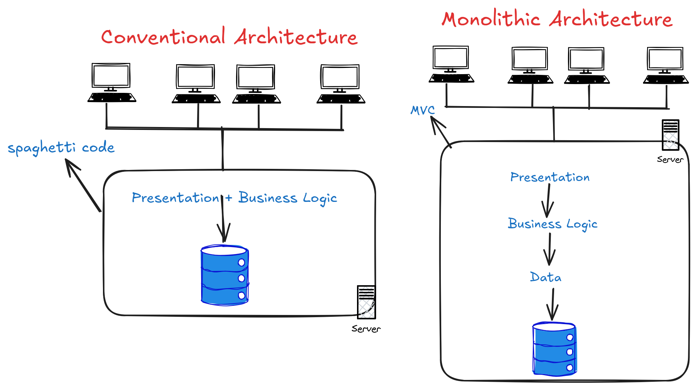

# architecture-comparison-node


## Overview

This repository contains two implementations of the same minimal task manager app (a Google Tasks clone) built to compare two software architecture styles side by side using the same exact tech stack. The only difference between them is how the code is organized internally.



## Projects

| Folder | Architecture | Core idea |
|---|---|---|
| `spaghetti/` | Conventional (Spaghetti) | All logic mixed in a single file — no layers |
| `lasagna/` | Monolithic MVC | Clearly separated Presentation, Business Logic, and Data layers |

The name "lasagna" is intentional — lasagna has clean, distinct layers, which is precisely what MVC enforces. Spaghetti has none.

## Getting Started

Run each app independently:

```bash
# Conventional app
cd spaghetti && npm install && node app.js
# → http://localhost:3000

# MVC app
cd lasagna && npm install && node app.js
# → http://localhost:3001
```

Both apps expose the same task CRUD features. Open them side by side and then compare the source code — that contrast is the whole point.

## Architecture Comparison

| Aspect | `spaghetti/` | `lasagna/` |
|---|---|---|
| Entry point | `app.js` (entire app) | `app.js` (setup only) |
| DB queries | Inside each route handler | Only in `db/taskModel.js` |
| HTML rendering | Inside each route handler | Only in `views/` via controller |
| Adding a feature | Edit one large file | Edit the relevant layer only |
| Maintenance | Gets harder as code grows | Stays manageable |
| Best for | Quick scripts, prototypes | Any app meant to grow |

## Key Takeaway

Both apps work. Both use the same tools. The difference is invisible to the end user but enormous for the developer reading or maintaining the code. This repo makes that invisible difference visible.

Understanding spaghetti code is not about judging early developers — it is about recognizing a pattern that emerges naturally without deliberate structure, and knowing why layered alternatives like MVC exist.

## License

MIT
